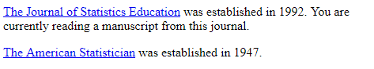
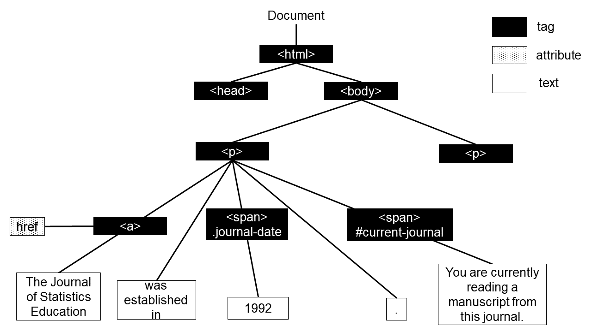
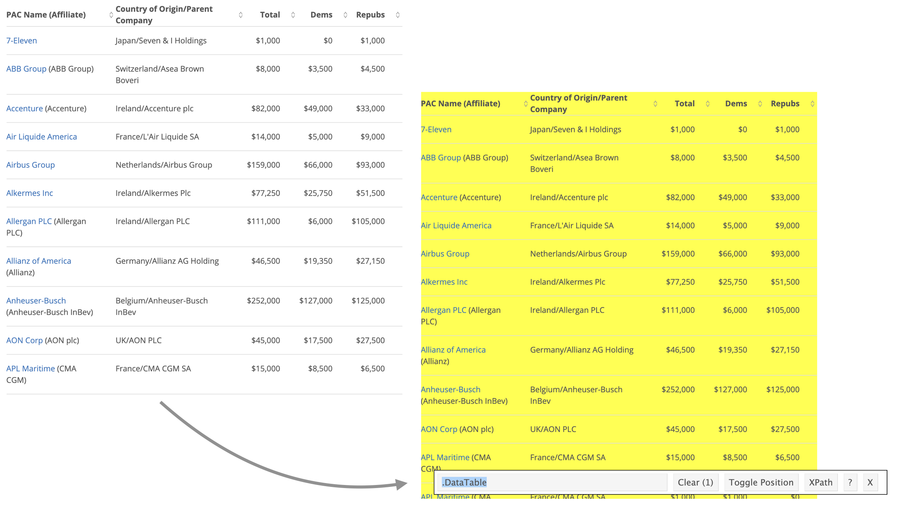

```{r blinding, echo=FALSE}
blind <- FALSE
```

```{r knitr_options, include = FALSE}
knitr::opts_chunk$set(echo = TRUE, out.width = "100%")
#knitr::opts_knit$set(kable.force.latex = TRUE)
library(readxl)
library(kableExtra)
library(scales)
options(knitr.kable.NA = "")
```

# Introduction

From rental housing prices to daily weather temperatures, the world wide web is a great resource for locating real and current data for the statistics and data science classrooms. 
Inclusion of authentic data experiences has been at the core of recommendations for statistics curricula for many years including the GAISE College reports [@GAISE2016; @GAISE2005] as well the earlier version of these recommendations in the @MAA1992 report. 
Prior research suggests that students’ perceptions of statistics being relevant in real life is associated with use of real data in the statistics classroom and students find the course interesting when real data is used [@Neumann2013].

With or without the instructors' intent to rely on the web as the source of data, many novice learners often turn to the web to locate real data for class projects. 
Without any formal training on retrieving data from the internet in an automated fashion, they often rely on hand scraping which consists of manually entering the data into a spreadsheet or copy-pasting. 
Both of these methods are time consuming and error-prone. 
In contrast, web scraping techniques allow students to gather unstructured information from the internet and convert it into a structured form in a rectangular fashion that meets tidy principles [@wickham2014tidy]. 
Web scraping is the process of extracting data off the web programmatically and transforming it into a structured dataset. 
Web scraping allows for larger amounts of data to be collected in a shorter span of time and in an automated fashion that minimizes errors. 

There are two types of web scraping. 
The first is screen scraping, where you extract data from source code of a website, with an HTML parser or regular expression matching. 
The second is using application programming interfaces, commonly referred to as APIs. 
This is where a website offers a set of structured HTTP requests that return JSON or XML files. In this paper we focus on the former, however we note that prior to going down the screen scraping path, it's recommended to first check if a website offers an API to access their data.  

In addition to being helpful for gathering data for class projects, web scraping as a skill has benefits for the student, regardless of whether their career trajectory involves working in industry, government, or academia. 
For example, many national statistical agencies started relying on web scraping as a form of data collection, including the Italian National Institute of Statistics, ISTAT [@Polidoro2015], the Federal Statistical Office of Germany, Destatis [@Destatis], and Statistics Netherlands [@Bosch2018]. 
One widespread way such agencies use web scraping is in automating the collection of prices of specific consumer products (e.g. electronics, housing, and medicine) to calculate some form of index of consumer prices. 
Uses of web scraping for data collection for other purposes have also been considered. 
The United States Census Bureau is building a tool that automatically scrapes tax revenue collections from websites of state and local governments as opposed to collecting this information with a traditional questionnaire [@Dumbacher2016].
Similarly, Statistics Canada is looking into ways how they can incorporate web scraping to reduce the burden on survey responders (\citeyear{StatCanada2019}).

In industry, perhaps the best-known scraper is Googlebot [@Google] which scrapes data from many web pages for Google's search engine. 
Web scraping is also often used in e-commerce. 
For instance, flight comparison websites scrape data from multiple airlines [@Poggi2007]. 
Many e-commerce websites scrape pricing information from their competitors' websites [@Stiving2017].

With its increased use, web scraping has become an important skill in the work force. 
A simple job search (conducted on November 11, 2019) on LinkedIn for "web scraping" returned 234 job listings. 
For comparison, our searches on "Bayesian", "linear models", and "chi square" returned 1236, 259, and 60 job listings, respectively. 
Our online job search has also shown that web scraper is in fact  a job title and not just a skill that is listed in job ads. 
Distil Networks reported a salary range up to $128,000 for web scrapers (\citeyear{distil}). 

Inclusion of web scraping in the statistics and data science curriculum is not a novel idea. 
When Nolan and Temple Lang (\citeyear{Nolan2010}) called for inclusion of modern computing in statistics curricula, they emphasized increase in use of web data and statisticians' need to access web data. 
In addition, their book on XML and web technologies has been an important guide for data scientists (\citeyear{nolan2014xml}).
In the last decade since their paper, as the emphasis on computing topics increased in statistics education, web scraping gained popularity as well. 
In a survey of seven schools that had incorporated data science topics in their statistics curricula, @Hardin2015 reported that six of the seven schools cover web scraping. 
More recently, in their guide to teaching data science Hicks and Irizarry (\citeyear{Hicks2018}) listed web scraping and accessing web data via APIs as part of an introductory data science course. 
Similarly, @Loy2019 developed a set of tutorials and case studies that support data science in the statistics curriculum and web scraping is one of the nine topics their projects cover.

Needless to say, we also believe that web scraping should be in every statistician's and data scientist's toolbox and it should be included in the curricula. 
There are vignettes, tutorials, and books written on the technical aspects of web scraping which can help instructors learn web scraping, however, we were not able to locate any resources that demonstrate and discuss how to teach web scraping. 
In this paper, we introduce technical tools for scraping data and provide a classroom activity as a concrete example. 
Based on our teaching experiences, we discuss some of the challenges of teaching web scraping and offer suggestions for how these may be overcome.
Lastly, we discuss the opportunities that web scraping brings to statistics and data science curricula. 

Throughout the paper, we introduce code for web scraping purposes. 
Considering length limitation of this manuscript, we provide the full code for analysis on a \href{\github{}}{GitHub repository}^[The GitHub repository can be found at \url{\github{}}]. 
In addition, the code is provided as an \href{\rstudiocloud{}}{RStudio Cloud project}^[The RStudio Cloud project can be found at \url{\rstudiocloud{}}.] so the readers who choose to run the code while reading the paper may do so. Within text we provide real code when introducing a concept but we use pseudocode for describing the bigger computational ideas. 

# Technical Tools

## HTML & CSS
\label{sec:html_css}


HyperText Markup Language (HTML) is the standard language behind almost every web document. Every web user interacts with HTML with or without realizing it. 
The main purpose of HTML is to handle content of a webpage such as text, hyperlinks, and images. 
CSS (Cascading Style Sheets) is another core technology for building web pages.
While HTML provides the structure of the page, CSS provides the styling and the layout.
Instructors teaching web scraping do not need to be fluent in HTML and CSS to teach web scraping, especially in the introductory data science class. 
However, a basic knowledge of these technologies can help instructors be a ahead of students and understand why things work the way they do. 
In this section, we provide a brief introduction to HTML and CSS. 

```{r html-example, echo = FALSE, fig.align = "center", fig.cap = "HTML document example", out.width="100%"}

```

Figure \ref{fig:html-example} shows a simple web page with text and hyperlinks, built using HTML.
The code below shows the back-end of the web page in this figure. 
Any HTML element is specified with an opening (e.g. `<html>`) and a closing tag (e.g. `</html>`) in this case, the `<html>` tag signifies creation of a HTML document. 
Within an HTML document there are two major sections as head and body of a document, both specified with their opening and closing tags. 
The `<p>` tag specifies a paragraph.

```html
<html>

<head>
</head>
<body>
	<p><a href="https://www.tandfonline.com/toc/ujse/current">
	The Journal of Statistics Education</a> was established in 1992. 
	You are currently reading a manuscript from this journal.</p>
	<p><a href="https://www.tandfonline.com/toc/utas20/current">
	The American Statistician</a> was established in 1947.</p>
</body>
</html>
```

The HTML code for the hyperlink for __The Journal of Statistics Education__ is multifaceted. 
The full code `<a href="https://www.tandfonline.com/toc/ujse/current">The Journal of Statistics Education</a>` first consists of an opening and closing anchor tag specified with `<a>` and `</a>` respectively. This tag defines a hyperlink.
Then the `href` attribute is set to a value of `https://www.tandfonline.com/toc/ujse/current`. This attribute specifies the destination of the hyperlink.

 
```{r html-css-example, echo = FALSE, fig.align = 'center', fig.cap = "HTML document with CSS example"}
knitr::include_graphics("img/html-css-screenshot.png")
```

Figure \ref{fig:html-css-example} shows a web page that uses CSS in addition to HTML. 
In order to make all the establishment dates of journals red a CSS class needs to be defined. 
In the code below a CSS class called journal-date is defined. 
CSS classes are defined in a style tag (or in a separate document) that is inside the head part of the HTML document. 
The names of CSS classes are preceded with a period.

```css
<style>
  .journal-date {
		color:red;
	}
</style>
	
```
Once the class is defined then it can be used in the body of the document to define the class of any HTML tag. 
The code below shows how to alter the color of the establishment year for Journal of Statistics Education. 

```html
<span class="journal-date">1992</span>
```

```{r html-tree, echo = FALSE, fig.align = 'center', fig.cap = "Partial HTML tree of HTML and CSS example"}

```

The rest of the styling in this web page is constructed in a similar fashion.
We summarize the structure of this web page with a partial document tree in Figure \ref{fig:html-tree}.
In this figure, we eliminated the elements of the head tag and focused on the body tag. 
In the body tag, we have provided only the first paragraph with the Journal of Statistics Education. 
The structure of the paragraph for the American Statistician has also been eliminated from the figure due to space limitations but is similar to the structure of the previous paragraph.
The white boxes in the figure represent the text that is visible to the web page user and the black boxes represent nodes of the document on the back-end.
Note that current-journal is preceded with a hashtag rather than a period which indicates that this is a CSS ID rather than a CSS class. 
CSS IDs are used to identify only one element in a document such as `#current-journal` only making the sentence _You are currently reading a manuscript from this journal_ italic. 
CSS classes can identify multiple elements such as `.journal-date` making multiple establishment years red.
It would be possible to use a class and an ID or multiple classes for a single HTML element. 
CSS selectors are used to select elements to style in an HTML document. Class and ID are two of the many CSS selectors. 
Readers may find the code for Figure \ref{fig:html-css-example} provided on the GitHub repo helpful to understand CSS classes and IDs.  

## SelectorGadget

Basic understanding of HTML and CSS can be useful for statisticians and data scientists working with web data. 
However understanding details of HTML and CSS as well as a web designer needs is neither necessary nor feasible within the constraints of a statistics or data science curriculum. 
Additionally, for students who are new to programming as a whole, even locating CSS selectors for elements of a web page or reading the source code for a webpage can be challenging. 
Thus, tools with a simple graphical user interface for locating CSS selectors on a web page can be immensely helpful in the data science classroom. 
A popular option for such a tool is the SelectorGadget, an open source extension for Chrome browsers. 
The SelectorGadget homepage features a video showing how SelectorGadget can be used to identify CSS selectors for page elements [@selectorgadget].
Similar extensions exist for other browsers as well, e.g. ChroPath for Firefox [@chropath].

## rvest package

The SelectorGadget helps identify the CSS selectors for certain elements in a webpage, and the next step is to grab these elements and import them into R, i.e. scrape them.
We use the **rvest** package for accomplishing this task [@rvest].  
This package makes it easy to scrape data from HTML web pages, and is designed to work with **magrittr** pipelines, which makes it a great fit for an R curriculum using the **tidyverse** suite of packages [@magrittr; @tidyverse]. 
In a nutshell, scraping data with rvest involves the following steps:

1. Read the HTML page into R with `read_html()`
2. Extract nodes corresponding to elements of interest with the help of the SelectorGadget to identify them and functions like `html_node()`, `html_table()`, etc.
3. Clean up the extracted text fields using string manipulation tools, e.g. functions from the **stringr** package [@stringr].

In the next section we give an example of a web scraping exercise where we provide details on how to use this toolkit for web scraping as well as details on activities and assignments that can be used in various levels of statistics and data science courses.  

Before we get started, let's load the packages we will need for this example.

```{r message=FALSE}
library(tidyverse)
library(rvest)
```

# Classroom Examples
\label{sec:examples}

In this section we present an example where students get to work with real data with an international appeal, from OpenSecrets ([opensecrets.org](https://www.opensecrets.org/)), "the most comprehensive resource for federal campaign contributions, lobbying data and analysis available anywhere" [@opensecrets]. 
This website is a rich source of information for political data, especially election related data at various levels, e.g. local, state, and national elections. 
For this example we will focus on contributions to United States elections from foreign-connected political action committees (PACs). 
The main reason why we decided to feature this particular data source is its international appeal -- students anywhere in the world likely have some interest in, or at least awareness, of US politics and elections nowadays, though data on local elections is likely not as interesting to them as data that has some international connection. 
We start the assignment with the following opening paragraph to help put in perspective why we're conducting this analysis:

> *Every election cycle brings its own brand of excitement -- and lots of money. 
Political donations are of particular interest to political scientists and other researchers studying politics and voting patterns. 
They are also of interest to citizens who want to stay informed of how much money their candidates raise and where that money comes from.*

>*In the United States, "only American citizens (and immigrants with green cards) can contribute to federal politics, but the American divisions of foreign companies can form political action committees (PACs) and collect contributions from their American employees" [@opensecrets-fpac]. 
In this assignment we will scrape and work with data on foreign connected PACs that donate to US political campaigns.*

Then we go on to explain what students will actually do as part of the assignment. 
An appealing aspect of this example, from an educator's perspective, is that it can be used at multiple levels, from simple table scraping to iteration over multiple pages. 
Whatever level the assignment is posed at, the ultimate findings are not trivial to deduce simply by interacting with the data on the website (e.g. by sorting tables, etc.). This feature of the task demonstrates the doors web scraping skills can open.

Before we dive further into sample exercises at various levels, let's first address an important concept that should be highlighted on any web scraping exercise at any level -- checking for permission to scrape the data.
This is a concept that can, and should, be introduced at any level without getting into too much technical detail.
A `robots.txt` file is a plain text file that lives at the root of a website and it consists of one or more rules, each allowing (or blocking) access for a given crawler to a specified file path in that website [@whatisrobotstxt].
Students can easily get what they need from the `robots.txt` file, i.e. whether the website allows for scraping, using the **robotstxt** package and specifically the `paths_allowed` function in this package [@robotstxt].

```{r check-paths-allowed, warning=FALSE, message=FALSE}
robotstxt::paths_allowed("https://opensecrets.org")
```

Indeed, we are allowed to scrape data from this website. Here we consider being "allowed" to scrape from a technical point of view but will expand it further in the Discussion Section. 

## Level 1: Scraping a table from a single website

We start off by presenting a simple data scraping exercise that involves grabbing data from a table from a single webpage on OpenSecrets.org which contains information on foreign-connected PAC donations in the 2020 election cycle.
What makes this exercise "simple" is that the data are already in tabular form so the students have an expectation of what it will look like in an R data frame. 
Additionally, the rvest package has a function for scraping data from an HTML table all at once and saving it as a data frame in R, so the programming component of the task is quite straightforward.

First, we load the rvest package, and read the data from the webpage by passing the URL of the page to the `read_html()` function from the rvest package. 
We'll save the result to an object called `page`.

```{r read-html-1, eval=FALSE}
url <- "https://www.opensecrets.org/political-action-committees-pacs/
       foreign-connected-pacs?cycle=2020"
page <- read_html(url)
```

```{r read-html-2, echo=FALSE, message=FALSE}
url <- "https://www.opensecrets.org/political-action-committees-pacs/foreign-connected-pacs?cycle=2020"
page <- read_html(url)
```

We then inspect this `page` object, a list in R, to give students a sense of the overall structure of an HTML page.

```{r view-page}
page
```

As shown in Figure \ref{fig:html-tree}, each HTML document is comprised of two parts: a declarative header section (denoted as `head`) and a `body` containing the document's actual content. 
With `read_html()` these two parts are read in as the two elements in the `page` list in R.  

If you are writing raw HTML to create a webpage it is important to understand the HTML tree because CSS selectors use this tree. 
However if you simply want to parse the data from the HTML code of a page in order to extract elements of interest for your analysis (like we're doing here), browsing through the entire HTML tree to find relevant elements is inefficient, both practically and pedagogically.
This is where the SelectorGadget comes into play. 
We can use the SelectorGadget to figure out the appropriate CSS selectors for elements of interest. 
Figure \ref{fig:table-2020-css-tag} shows how we can use the SelectorGadget to identify the CSS selector for the table of contributions on the page. 
If clicked on the table, the SelectorGadget highlights the table in yellow, and shows the CSS selector associated with it, `.DataTable` on the bottom right. 
We note that since this starts with a period, it is a CSS class, and use this tag as part of our web scraping code. 

```{r table-2020-css-tag, echo=FALSE, fig.cap="Identifying the CSS selector for the table of contributions using the SelectorGadget. Retireved on April 30, 2020.", out.width="100%", fig.align="center"}

```

Finally, we use the tag identified using the SelectorGadget to extract the relevant node from the HTML page we have already read into R.

```{r extract-table}
page %>%
  html_node(".DataTable") %>%  # extract node containing table
  html_table("td", 
             header = TRUE, 
             fill = TRUE) %>%  # extract the table
  as_tibble()                  # convert to tibble
```

Now that we have our data in R, we can walk the students through a few steps of data cleaning and text parsing (e.g. rename variable names, remove trailing spaces, etc.). 
We also recommend adding a new column to this data frame that records the year the data come from, since this information is not represented elsewhere in the data frame. 
Once the data cleaning is completed, we write out the data to a CSV file. 
We want students to get into the habit of writing out data they scraped so they don't have to scrape it over and over again, and also so that they have a record of the data in case it changes or the website goes down. 

In an introductory statistics course this might be all the web scraping the curriculum can spare time for. 
At this point students are equipped with the skills to scrape tabular data off the web, save it as a data frame in R, and also to save it as a CSV file to be used later. 
Depending on what else the course covers, they can then visualize or summarize this data, or build models with it. 

## Level 2: Writing functions

In an introductory data science course where foundational programming skills like writing functions might be a learning goal, we can use this web scraping exercise to motivate the need for functionalizing code and to demonstrate how to write functions.
The code developed in the previous section can be placed in a function that takes the URL of the page as an input, and then easily applied to URLs for contributions from other years.
Pseudocode for such a function is given below.

```{r functionalize}
scrape_pac <- function(url){
  # scrape data from the given url
  # clean the scraped data
  # return resulting data frame
}
```

Using data scraped from a few years with this function, students can do analyses where they compare contributions from certain countries or companies between different years.

## Level 3: Iteration

Teaching functions to facilitate repeating the web scraping task across multiple years opens the door for introducing the idea of iteration to scrape data from all available years. 
Certainly this can be done by running the function above twelve times (for the twelve years worth of data on OpenSecrets) but this is neither satisfying, nor recommended. 
There are two entirely valid computational approaches for automating this task: one is using for loops and the other is using functional programming to map the function the students have already developed over a list of all URLs to be scraped. 
In our courses we choose to present the latter approach since it is made easier using the **purrr** package, which is also part of the tidyverse [@purrr]. 
The `map_dfr()` function from this package is a great fit for this task since it maps a function over a list of elements, and saves the result as a data frame. 

```{r map-dfr, eval=FALSE}
pac_all <- map_dfr(urls, scrape_pac)
```

The function we are mapping is the `scrape_pac()` function we developed earlier, and the list of `urls` can be constructed using the fact that the URL for each year starts with the same text string, and then has the year appended at the end.

```{r list-of-urls-1, eval=FALSE}
root <- "https://www.opensecrets.org/political-action-committees-pacs/
        foreign-connected-pacs?cycle="
year <- seq(from = 1998, to = 2020, by = 2)
urls <- paste0(root, year)
```

```{r list-of-urls-2, echo=FALSE}
root <- "https://www.opensecrets.org/political-action-committees-pacs/foreign-connected-pacs?cycle="
year <- seq(from = 1998, to = 2020, by = 2)
urls <- paste0(root, year)
```

The resulting data frame, called `pac_all`, includes data from each year in a single data frame.

This exercise is appropriate for any course that covers material presented in Level 2, however it should be noted that introducing iteration and basic functional programming will require additional time. 
We usually devote at least one lecture to introducing these concepts as well as additional readings and an assignment that has them repeat a similar task on a different webpage to give the students an opportunity to practice.

## Level 4: Data cleaning and visualization

Finally students can analyze all foreign-connected PAC contribution data. 
Figure \ref{fig:uk-pacs} presents the result of one such analysis where we explore the contributions from PACs connected to the United Kingdom to the Democratic and Republican parties over time. 

```{r uk-pacs, echo=FALSE, fig.cap="Example analysis: visualization of contributions from PACs connected to the UK to the Democratic and Republican parties over time.", message=FALSE, fig.height=3, cache=TRUE}
pac_all <- read_csv("opensecrets/data/pac-all-clean.csv")
pac_all %>%
  filter(
    country == "UK",
    year < 2020
  ) %>%
  group_by(year) %>%
  summarise(
    Democrat = sum(dems),
    Republican = sum(repubs)
  ) %>%
  pivot_longer(cols = c(Democrat, Republican), names_to = "party", values_to = "amount") %>%
  ggplot(aes(x = year)) +
  geom_line(aes(y = amount, group = party, color = party)) +
  scale_color_manual(values = c("blue", "red")) +
  scale_y_continuous(labels = dollar_format(scale = 0.000001, suffix = "M")) +
    scale_x_continuous(breaks = seq(2000, 2016, 4)) +
  labs(
    x = "Year",
    y = "Amount",
    color = "Party",
    title = "Contribution to US politics from UK-Connected PACs",
    subtitle = "By party, over time"
  ) +
  theme_minimal()
```

Creating such a figure requires a series of data manipulation steps, e.g. filtering for PACs from the UK, summarizing yearly total contributions, reshaping the data from wide to long format, prior to creating the visualization. 
Most importantly, it communicates to students that acquiring web scraping skills can open doors to data insights that would otherwise be impossible or incredibly tedious to complete.
While this exercise is presented as Level 4, it does not actually require a higher skill. 
In courses where Levels 2 or 3 may not fit in the curriculum, instructors can scrape the full dataset and give it to their students so that they can work on the visualization task even if they don't go through the entire data scraping cycle themselves.

# Challenges

There are four main challenges in teaching web scraping. 

The first challenge with teaching web scraping in the classroom is the difficulty of reproducibility. 
There are two main reasons for this. 
First, the data is not static, so even if you use the same code to scrape the data at a later time, you will get different results if the source data on the website you are scraping has been updated. 
Consider scraping data on rental houses in your local region and quantifying the relationship between size and price. 
Then consider repeating this task a month later. 
Your results will certainly change with data on new houses going on the rental market, and you may not be able to observe certain characteristics you observed before with new data (e.g. outliers). 
If the goal later in time is to explore the same data as earlier, this challenge can be overcome by saving the original website source and not-rescraping at a later time. 
Depending on the complexity of the web scraping task this can be as simple as saving the HTML source read into R as an RDS file, or it can be much more challenging. 
It also requires a manual step of remembering to save this result, which can be a challenge for students new to web scraping. 
However often times this challenge in itself can present an opportunity to discuss the dynamic nature of data, which can bring a fresh perspective to how students think about data. 

Another reason for the lack of reproducibility is that websites change their structure over time, and code that once worked to scrape a website might no longer work. 
There is no quick fix for overcoming this challenge, but it is likely that the updates to the code that need to be made to adapt to the new website structure will not be as challenging a task as writing web scraping code from scratch. 
We suggest that instructors communicate these challenges around reproducibility early on, as opposed to waiting for their students to come upon them and get frustrated. 

A second challenge is handling of missing data. 
Since missing data is a common challenge for anyone working with data, many statistical methods and algorithms have been developed to enable estimation in the presence of missing data. 
However, in the case of web scraping, the challenge with missing data is not necessarily an estimation problem but instead a data retrieval problem. 
To distinguish the two, we will call the latter a missing node problem. 
Consider a Craigslist page with 10 rental homes. 
We can scrape information from this page on the characteristics of each house, such as number of bedrooms, number of bathrooms, and square footage. 
These three characteristics are represented next to each other on the website. 
Suppose that we are using a method for web scraping that retrieves information on each of these variables individually and stores them as vectors. 
If we have all three pieces of information on all 10 houses on the page, we would end up with three vectors (one for each variable), each of length 10 (one element for each house). 
We can then column bind these vectors together to make a data frame of 10 rows and 3 columns to be used in our analysis. 
However, assuming that all the houses would have information on all three characteristics is wishful thinking, especially on a website like Craigslist where the information on each house is manually entered by the person posting the rental listing. 
Suppose square footage information is missing for one of the houses. 
Then, the vector with the square footage information would only have 9 elements, rather than having ten elements with one of them being `NA`. 
It would be impossible to know where the `NA` value in the vector is without doing additional manual work. 
In addition, it would not be possible to combine the three vectors with lengths of 10, 10, and 9.
We believe that, the best approach is to avoid using web pages that are likely to have missing nodes in the introductory classroom. 
Not only retrieval of the missing nodes would be hard but also students are less likely to be equipped to handle missing data. 
Note that web pages have nested structures as previously shown in Figure \ref{fig:html-tree}. 
Even though bedroom, bathroom, and square footage all have their unique nodes, they also have a higher node that combines the three. 
For more advanced courses, missing nodes can be retrieved by scraping a node in the higher nested structure and then by using string manipulation.

A third challenge is the need for instructors to be aware that they have no control of the web. 
Thus it is important to note potential issues related to connectivity and content. 
For example, in one of our classes, students were assigned to scrape data on college basketball matches from a specific website as part of their homework. 
However, while students were working on the homework, the server of the website went down, and it was impossible for the students to complete the homework. 
We had to push the homework deadline until after the website was up and running again, but this was a less than ideal solution. 
Thus we recommend that instructors be ready to provide alternatives or extensions in such cases. 
One potential remedy is to save the source code of the website and host it on a local web server that the instructor has control over. 
However this task may not be trivial if the website is complex, and there may also be legal considerations around re-hosting source code, even for educational purposes. 

Even though instructors do not have control over connectivity on the server side, they do have control over connectivity on the user side, and they should be mindful of it. 
Each time a student is scraping off the web, as a user they send a request to the server to get information over the web page. 
If they are working with an iterative case such as in the level 3 of the aforementioned example, then each student would be sending multiple requests for multiple web pages. 
If this is happening in a classroom setting, multiple students would be sending multiple requests to the same server. 
Web servers only allow certain number of requests per second and thus the server will either ban requests or slow down the speed of information retrieval. 
Even though web scraping can provide large amounts of data for the data science classroom, the speed will matter and differ. 

An important step is to consider the amount that is being scraped. 
Does the whole set of data really need to be scraped to achieve the learning goals of the class? 
For instance, Internet Movie Database (IMDB) has 11,905 (as of November 26, 2019) featured movie titles from 2018 and information on rating, number of votes, domestic gross and many other features of the movies are provided [@IMDB].
Each web page has 50 movies and if one were to scrape all the movies the code has to iterate over 239 web pages. 
If the goal is to teach how to scrape and iterate over web pages, the goal can easily be achieved by iterating over a much smaller number of web pages. 
For example, if students can scrape data from the first three web pages, they can scrape from 239 web pages assuming that page structures are similar. 
They just need to be aware that the larger task will take a longer time. 
Another approach to lowering the amount of data scraped can also be taking a sample either in random sample format or in random clusters where each web page would be a cluster and this would be a computationally easier solution and statistically a more interesting one.

Finally, a fourth challenge is that instructors do not have control over the content of the web. 
We can divide content into two as data maintained by staff affiliated with the website vs. data input by users. 
Consider IMDB where information about movies are retrieved from a database that is maintained by IMDB itself. 
Even though users can add movie titles and information related to a movie, IMDB staff spend time to review the user submissions.
Now consider Craigslist, a website where anyone can submit anything, and there is minimal monitoring of data entry.
For instance, you may find a house with 1000 bedrooms and that is only 2 square feet.
Such data entry problems are not limited to web scraping and can be faced even with traditional data collection tools such as pen and paper. 
Even though we list this as a challenge, we also believe this can be considered an opportunity for data cleaning. 
Instructors need to take their students' level into account to decide whether the students should be faced with this challenge or not. 
If the time is limited and the goal is to complete a specific analysis, tasks where web scraping is done on pages like IMDB may be more appropriate. 
However, if the goal is data cleaning, exercises like scraping data off of Craigslist would turn this challenge into an opportunity.
Data that requires a lot of cleaning may also be considered as outside of class activity at more advanced levels. 

# Opportunities

The biggest opportunity web scraping brings to the classroom is the data itself. 
The web offers data that is current and interesting. 
In the past, traditional statistics courses have been mainly taught with toy datasets that are clean and have few variables, often the only variables needed for a specific analysis. 
More recently, many statistics courses have adopted the use of real and current data, even if the data sets may have been tamed slightly to help demonstrate particular models or methods. 
An instructor with web scraping skills can incorporate truly timely data into their curriculum, which can enrich the data repository of any course. 
And since web data often come with the story of why the data were collected in the first place, instructors can share these stories with the students to provide motivation [@Grimshaw2015]. 

Without web scraping skills, students are limited to hand scraping or to datasets that already come in as CSV or Excel files. 
In some situations, such files might contain exactly the data students want. 
But in many situations, being limited to data that is already presented in a structured format can limit students' options, and their data analysis projects might be driven by the availability of structured data instead of what they really want to investigate. 
Even though the examples we have provided in this paper target the learner, web scraping is also an important tool for the instructor, who is essentially the lead learner. 

Further to content of the data, size, shape, and the format of the data are another opportunity. 
As suggested by @Horton2015b, integration of experiences with large, complex, and messy datasets that don't come in a rectangular data matrix is an important consideration for a statistics curriculum, and web scraping can provide an opportunity to do all of this.  
While the Open Secrets example we provided earlier used data that came in a tabular format, it is very common for a web scraping exercise to feature harvesting data that is scattered around a page and cannot be extracted as a table. 
Regardless of whether the data comes in a tabular format or not, web data often requires post-processing, e.g. text parsing, data cleaning, reshaping, etc. to prepare it for statistical analysis. 
It also exposes students to file formats beyond the standard CSV and Excel files (e.g. HTML, JSON, and XML) as well as to the idea of "text as data" which can pave the way to further data science topics like sentiment analysis.
For example, in one of our classes, for their final project, a student had scraped song lyrics of their favorite band and had done a sentiment analysis of the song lyrics. 

Another important opportunity that web scraping brings to the data science classroom is blending computing and statistics topics through problem solving, rather than using hypothetical scenarios. 
Consider level 2 of the example provided above, where we introduce the concept of writing functions. 
In this situation, the function solves a real problem (getting data off a webpage given its URL) as opposed to a toy one (e.g. adding one to its argument). 
Two additional computing topics that often come up in web scraping are iteration, as seen in level 3 of the example, and string manipulation. 

Finally, for those of us who teach with R Markdown files, web scraping provides an opportunity to introduce R scripts with a clear motivation for not using R Markdown. 
Code for web scraping functions and saving the scraped data as CSV files go into R scripts -- this code is run only once. 
Then, the data analysis (visualizations, summarizations, modeling, etc.) is completed in R Markdown documents that begin with reading data from the CSV files they created -- this code gets re-run every time the R Markdown document is knit. 
This process presents two opportunities: (1) discussing valid reasons for not wanting to run certain types of code each time we knit an R Markdown document (we don't want to keep hitting the web servers of the page we are scraping), and (2) introducing students to file formats other than R Markdown for writing reproducible code, which leads the way to teaching good workflow practices. 

Last but not least, an important aspect of teaching web scraping is the discussion of ethics that it brings to the classroom. 
Awareness of ethical issues is one of the nine goals in the latest GAISE College report (\citeyear{GAISE2016}) and others have been thinking about inclusion of ethics in the statistics and data science curriculum as well [@Baumer]. 
A common misconception surrounding using web data is that if the data is publicly available, it can be scraped. 
Our approach to handling this misconception in the classroom is three-fold. 
When scraping data, one should take into account whether the server allows for bots to access the web page. 
In the aforementioned example this was achieved by using the `paths_allowed()` function from the `robotstxt` package. 

The second point to consider is privacy and consent when the data is about human subjects. 
A popular web scraping controversy was about data scraped from OkCupid, an online dating website, by a group of scientists, and provided on PyschNet, an open science community. 
The data included usernames and potentially sensitive information such as drug use, political affiliation, and sexuality [@Woolacott2016]. 
Considering that an important portion of data on the web comes from users, we suggest that instructors make students aware of the distinction of human subjects and non-human subjects and possibly introduce them to Institutional Review Boards at their institutions briefly, if not already done so. 

The third point we also consider is the legality of web scraping. 
The laws regarding web scraping are not yet set in stone and the law arena about web scraping remains unclear [@Zamora2019]. 
There are two popular cases that instructors can bring up as examples in the classroom. 
The first is a dispute between EBay and Bidder's Edge in 2000 when a court decided to ban Bidder's Edge scraping data from EBay. 
The second is a more recent case of a dispute between LinkedIn and HiQ where the court decided that scraping publicly available information from LinkedIn is not same as hacking, however there may be copyright infringement [@Robertson2019]. 
As law is catching up with data practices, the way we teach web scraping in the future will be shaped by legal practices. 
It is important for instructors to make students aware that having technical skills to scrape data does not necessarily mean they should or they are allowed to scrape. 
This distinction is really important. 

# Discussion

We cannot envision a data science curriculum without web scraping. 
In this paper we attempted to communicate this vision by first placing web scraping within the statistics and data science education landscape. 
Then, we presented a web scraping activity at varying levels of difficulty for the data science classroom. 
Based on our teaching experience, we provided potential challenges of teaching web scraping and how to overcome them. 
We also described in detail what opportunities web scraping brings to the data science classroom. 
When the challenges are overcome, the opportunities provide meaningful learning experiences for the learner. We encourage statistics and data science instructors to teach web scraping. 

Over the last five years, we have taught web scraping as part of many courses and in different institutions including, small liberal arts colleges, large private and public research universities. 
On 14-15 week semester systems, at the undergraduate level, we have taught web scraping in introductory data science, data analytics, and statistics courses (algebra-based) as well as in secondary (algebra-based) linear models courses. 
In 10-11 week quarter systems, we were unable to cover web scraping in (calculus-based) introductory probability and statistics courses, however we were able to cover it in introductory data science courses. 
We have experimented with teaching web scraping towards the end of the term (in the last 3-4 weeks), after students have gained a good amount of computational experience, as well as mid-semester (around week 5), immediately after data visualization and wrangling units, so that students could use their newly acquired skills in putting together their final project proposals. 

In this paper, we focused on scraping data from its source code. In addition to source code, some websites offer application programming interfaces (APIs) through which data can be accessed. 
One option for introducing harvesting data from the web via an API is to use an R package that provides a set of functions to communicate with that API, e.g. **rtweet** for accessing Twitter’s REST and stream APIs [@rtweet], **ZillowR** for accessing Zillow's Real Estate and Mortgage Data API [@ZillowR], and **genius** for accessing song lyrics via the Genius API [@genius]. Working with web APIs using packages like these can be introduced at any level as the package functions simplify the tasks to be no more complicated than working with the rvest package for scraping HTML data. For a more thorough treatment of working with web APIs, we would recommend teaching this process after web scraping. For example, OpenSecrets has an API so one could extend the example provided above to replicate the same analysis by fetching the data via their API. This is not a computationally much more complicated task, however it does require introducing the concept of hierarchical data and new data types -- most likely JSON or XML. There are numerous R packages for parsing such data and flattening them into a rectangular data frames, which can then be used as starting point for an analysis like the one we exemplified above. Having worked with web data previously will help students as they learn these new concepts and tools, and hence we recommend introducing working with web APIs either in upper-level courses or earlier computational courses where learning goals include working with hierarchical data.

As demonstrated in Section \ref{sec:examples}, the specific web scraping topics we cover depend on the level of the course. Table \ref{tab:skills-table} summarizes how we sort these topics into courses at various levels and also into computational and statistical categories. 
From a computing perspective, with the help of SelectorGadget, at the most basic level web scraping can be taught as soon as students are able to use R functions from multiple packages. 
However, we believe that web scraping activities are more effective when students gain some maturity working with data so that they have enough statistical knowledge to make meaning of the data that they scrape.
For instructors who are new to web scraping, in addition to the elementary topics that we have listed for students, we also recommend a basic understanding of HTML and CSS as we have outlined in Section \ref{sec:html_css}. Instructors who are novice web scrapers should avoid teaching on the spot and fully write the code for scraping activity before teaching students.

```{r skills-table, echo=FALSE, message=FALSE}
skills_table <- read_excel("summary-skills.xlsx")
col_names <- names(skills_table)
col_names[1] <- ""
knitr::kable(skills_table, booktabs = T, col.names = col_names,
             caption = "An overview of statistics and computing topics in the web scraping classroom") %>%
  row_spec(2, hline_after = T) %>%
  row_spec(6, hline_after = T) %>%
  kable_styling(latex_options = "hold_position")
```

Even though we do not have experience teaching the topic at the graduate level or advanced undergraduate levels, we believe that at these levels web scraping will also provide an opportunity to expose students to working with web APIs and hierarchical data retrieved from them (JSON and XML files) as well as further details of HTML and CSS.

For instructors who are interested in adopting web scraping activities in their teaching, we provide the following set of questions as a starting point to consider when deciding on which website to scrape from: 

- Is the data from human subjects? If yes, is it ethical to scrape the data?
- Does the website provide an API?
- Does the website allow web scraping?
- Are the data provided in an HTML table?
- Are the CSS Selectors easy to select with SelectorGadget?
- Is there non-numeric data? If yes, how easy is it to manipulate it?
- Would the process of scraping involve iteration over multiple pages? If yes, how much data are you planning to scrape, all or a sample? 

We presented a brief introduction to web scraping using R for HTML parsing. 
However, the world of web scraping is richer than what we could provide here as examples. 
For example, many of the pedagogical opportunities and challenges we discussed would also apply to doing web scraping in Python, using a package like Beautiful Soup [@Richardson2007]. 
Additionally, the example we presented used a specific combination of technologies -- a Chrome browser with the SelectorGadget extension, and the rvest and tidyverse packages. 
While we believe that this set of tools are the best choice for web scraping in R, from both pedagogical and technical perspectives, there are many other combinations of tools one could use to accomplish the same results in R. 
The tools for web scraping get richer every day as the need for harvesting data off the web efficiently and effectively grows, but the pedagogical considerations presented in this paper as well as the technical tooling should stay relevant for the foreseeable future. 
\pagebreak


# References {.unnumbered}
